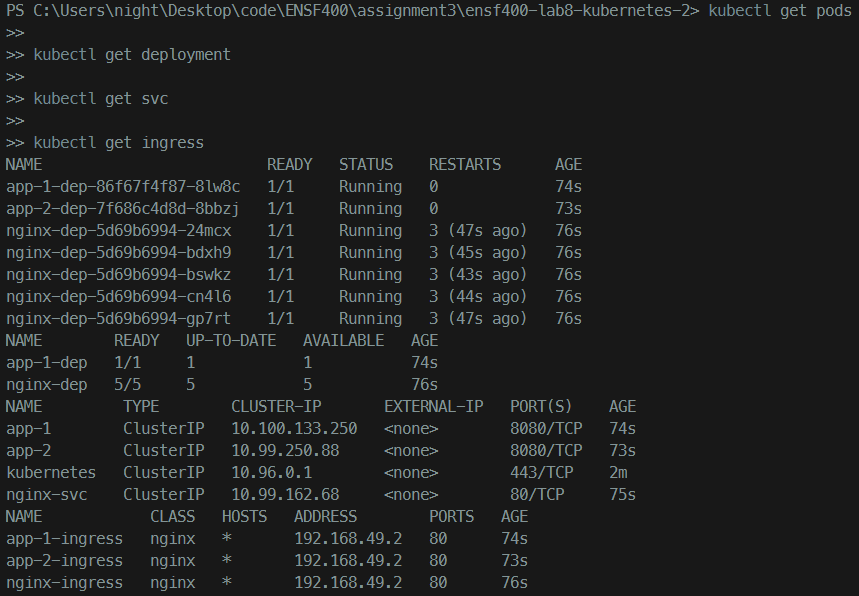
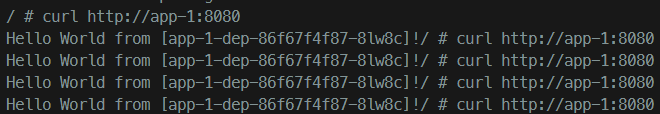
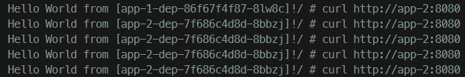
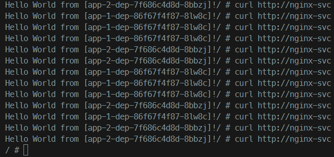

# ENSF400-A3

Start Minikube:

```bash
minikube start
```

NGINX setup:kubectl apply -f nginx-dep.yaml

Apply Apps 1 and 2:

```bash
kubectl apply -f app-1-dep.yaml
kubectl apply -f app-1-svc.yaml
kubectl apply -f app-2-dep.yaml
kubectl apply -f app-2-svc.yaml
```

Apply ingress:

```bash
kubectl apply -f app-1-ingress.yaml
kubectl apply -f app-2-ingress.yaml
```

Check resources:

```bash
kubectl get pods
kubectl get deployment
kubectl get svc
kubectl get ingress
```



# Test Requests and Responses:

Run a container to test the requests and response.

```bash
kubectl run tmp-shell --rm -i --tty --image alpine -- /bin/sh
```

Within the container:

```bash
apk add --no-cache curl
```

Run the following command to test `app-1`:

```shell
curl http://app-1:8080
```

Output:



Run the following command to test `app-2`:

```shell
curl http://app-2:8080
```

Output:



Run the following command a few times to test the `nginx load-balancer`:

```shell
curl http://nginx-svc
```

Output:



# Delete all resources and cleanup

```bash
kubectl delete deployments --all
kubectl delete pods --all
kubectl delete ingress --all
kubectl delete svc --all
kubectl delete configmap --all
```
